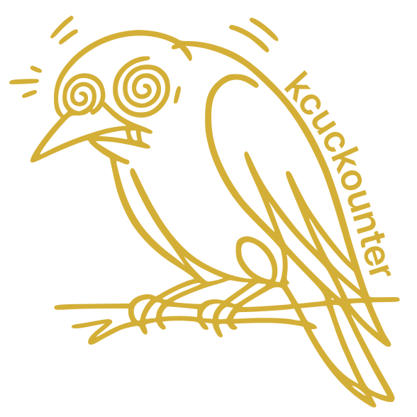
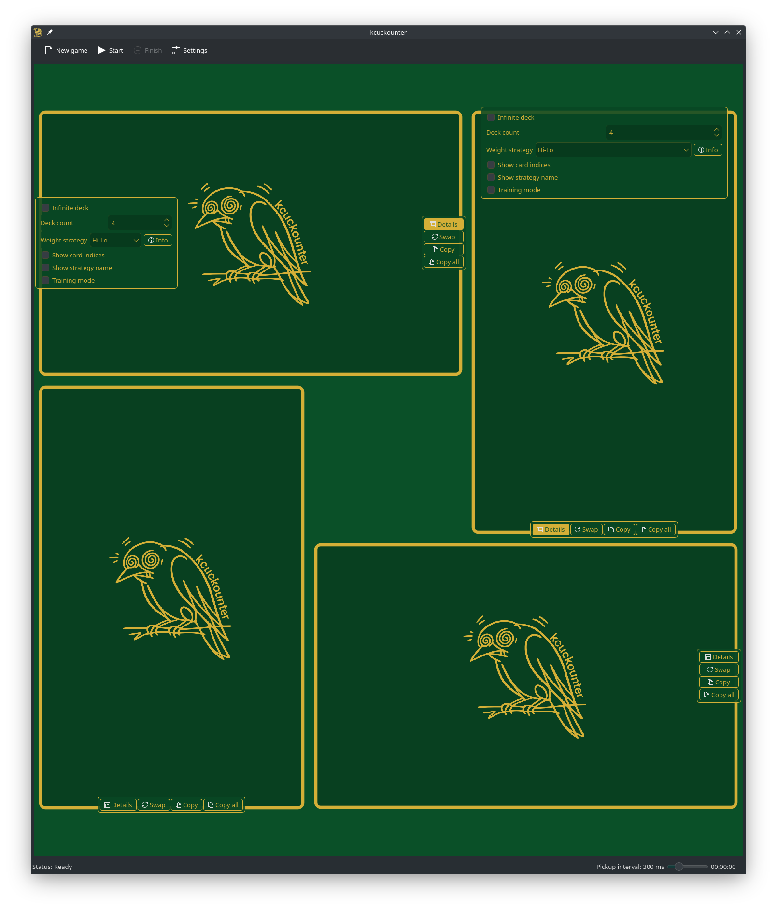
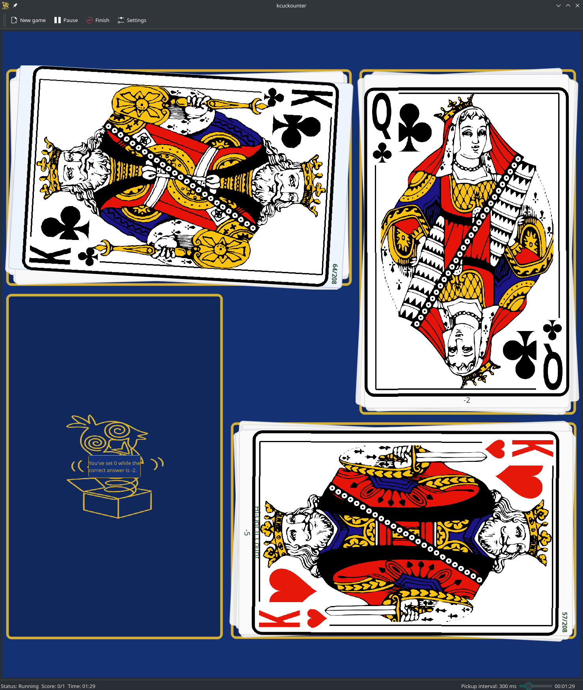

# kcuckounter

## ...one flew east, one flew west,  One flew over the multiple decks.

> Just play poker in Indian Casinos and stay single and live where and how he wants to, if people would let him,
>   P.R. said — but Chief released him.

They're out there.  
Black Kings and Red Queens in suits — up before me, to be committed to the repository and get mopped up before you can
memorize them.

## Brief Description

**kcuckounter** is an educational game. The project aims to
improve basic arithmetic skills and memory retention by counting cards in
different table-slots with different strategies. The user has the option to use
one of the preloaded strategies (Hi-Lo, Hi-Opt I, Hi-Opt II, Zen Count and
other) or create their own custom strategy. The game is implemented in C++ with
using Qt6, KF6, KDEGames6 and carddeck packs from kdegames-card-data-kf6.

## Gameplay

|               |                  |
|--------------------------------------------------------------|---------------------------------------------------------------------|
|  | todo: |

At the beginning of the game, the user customizes the number of table-slots, and
for each table-slot, they can choose the number of standard playing card decks
and the strategy. The abstract dealer then picks up one card from one or more
table-slots (depending on the level of difficulty). The user must keep track of
the sum of the weight of the cards in each table-slot, taking into account the
weight assigned to each card in the chosen strategy.

If the next picked card is a joker, the user must answer a joker's question to
continue playing. The joker card has no weight and is rare, so answering
correctly about the current weight of the table-slot with the joker card changes
the score.

The score is based on the player's ability to answer the joker questions
correctly and is measured by the number of jokers the player has guessed
correctly out of the total number of joker questions.

The main focus of the game is to improve arithmetic skills and memory, and the
score serves as a motivational tool.

## Requirements

To build **kcuckounter** you need a C++20 toolchain, CMake and the Qt 6
stack with KDE Frameworks 6. Typical packages are:

* `cmake` and a C++ compiler (e.g. `clang++`)
* Qt 6 base and svg modules
* KDE Frameworks 6: `kcoreaddons`, `ki18n`, `kxmlgui`, `kconfigwidgets`,
  `kwidgetsaddons`, `kio` and `libkdegames`
* `extra-cmake-modules`
* **lcov**: for code coverage reports
* **doxygen** and **graphviz**: for generating documentation

## Setup and Installation

## Documentation and Contributing

For detailed documentation, see the [Documentation](https://ninjaro.github.io/kcuckounter/doc/) and for the latest
coverage report, see [Coverage](https://ninjaro.github.io/kcuckounter/cov/).

## Security Policy

Please report any security issues using GitHub's private vulnerability reporting
or by emailing [yaroslav.riabtsev@rwth-aachen.de](mailto:yaroslav.riabtsev@rwth-aachen.de).
See the [security policy](.github/SECURITY.md) for full details.

## License

This project is open-source and available under the MIT License.
